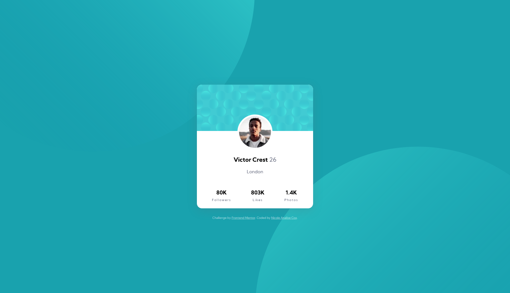

# Frontend Mentor - Profile card component solution

This is a solution to the [Profile card component challenge on Frontend Mentor](https://www.frontendmentor.io/challenges/profile-card-component-cfArpWshJ). Frontend Mentor challenges help you improve your coding skills by building realistic projects. 

## Table of contents

- [Overview](#overview)
  - [The challenge](#the-challenge)
  - [Screenshot](#screenshot)
  - [Links](#links)
- [My process](#my-process)
  - [Built with](#built-with)
  - [What I learned](#what-i-learned)
- [Author](#author)

## Overview

### The challenge

- Build out the project to the designs provided

### Screenshot

### Links

- Solution URL: [https://www.frontendmentor.io/solutions/profile-card-component-html-and-css--yM7wGN41](https://www.frontendmentor.io/solutions/profile-card-component-html-and-css--yM7wGN41)
- Live Site URL: [https://nicoleanalisecox.github.io/profile-card-component/](https://nicoleanalisecox.github.io/profile-card-component/)

## My process

### Built with

- HTML
- CSS

### What I learned

**Day 1: **
Added HTML structure, divs etc and started with basic css styling. Learned about flexbox. 
To get the three data items (stats section) in the card positioned, I used 3 x divs and made the parent container the bottom part of the card with display: flex, then used justify-content: space-evenly for spacing. 
These resources were helpful for Flexbox.
[A guide to flexbox](https://css-tricks.com/snippets/css/a-guide-to-flexbox/)
[Don't overthink flexbox grids](https://css-tricks.com/dont-overthink-flexbox-grids/)

**Day 2: **
Styled the fonts (colours and weights). Added a drop shadow to the main card background. 
Centered the main card to be vertically and horizontally centered. 
This was a helpful resource in centering: 
[How to center an object exactly in the center](https://css-tricks.com/quick-css-trick-how-to-center-an-object-exactly-in-the-center/)

**Day 3: **
Adjusted the images to stick in the same position with different screen sizes. Lots of playing around with different css positioning. In the end, I used the viewport height (vh) and viewport width (vh) units for values in the background-position property. 
vw is relative to the full width of the browser window, and vh the height. Unlike % which is the % length relative to the container element. 
This was a helpful resource in understanding vh and vw:
[Fun viewport units](https://css-tricks.com/fun-viewport-units/ )

This page was useful in looking at background attributes:
[CSS3 Background property](https://www.w3schools.com/cssref/css3_pr_background.asp)

And finally tidied up the stylesheet and HTML. 

### Issues I had:
**Problem:**
Background image of div wouldn't show up. 
**Solution:**
Reference to img src was incorrect. Ensure it's relative to the CSS stylesheet. 

**Problem:**
There was a slight gap between the border of the circular image and the image itself.
**Solution:**
Applied a background-color to the relevant class. 

## Author

- Website - [Nicole Analise Cox](https://www.nicoleanalisecox.co.uk)
- Frontend Mentor - [@nicoleanalisecox](https://www.frontendmentor.io/profile/nicoleanalisecox)
- Instagram - [@nicolencode](https://www.instagram.com/nicolencode_)
- Twitter - [@_nicoleanalise](https://www.twitter.com/_nicoleanalise_)

